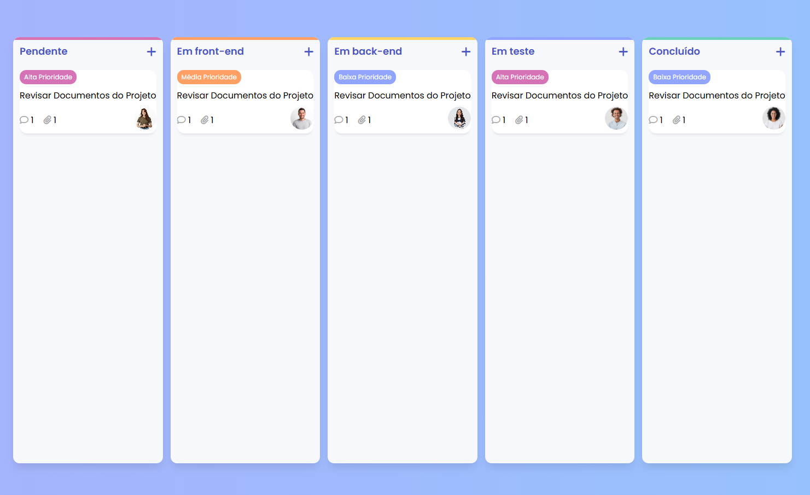

# 📌 Kanban de Tarefas

## 📖 Descrição

Este é um **Sistema de Kanban** desenvolvido para gerenciamento de tarefas, proporcionando uma interface intuitiva e organizada para acompanhar o progresso de atividades.

## 🚀 Funcionalidades

- 📌 Organização das tarefas em colunas (Pendente, Em andamento, Em teste, Concluído).
- ✅ Definição de prioridade (Baixa, Média, Alta).
- 👤 Atribuição de responsáveis às tarefas.
- 🔄 Movimentação dinâmica entre os status.

## 🛠 Tecnologias Utilizadas

- **HTML** → Estrutura da aplicação.
- **CSS** → Estilização e design responsivo.
- **JavaScript** → Manipulação do DOM e interatividade.

## 🎯 Objetivo

Facilitar o gerenciamento de tarefas, melhorando a organização e produtividade por meio de um sistema visual simples e eficiente.

## 🏆 Créditos

Este projeto foi inspirado no trabalho de [Larissa Kich](https://github.com/Larissakich), que compartilhou um guia detalhado sobre como desenvolver um sistema de Kanban estilizado. Agradecemos pela sua ajuda!
